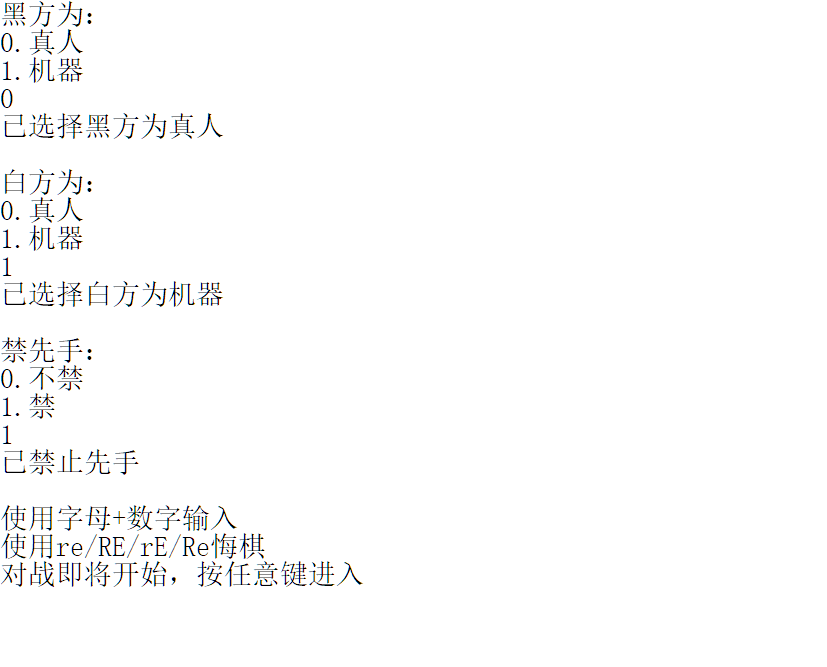
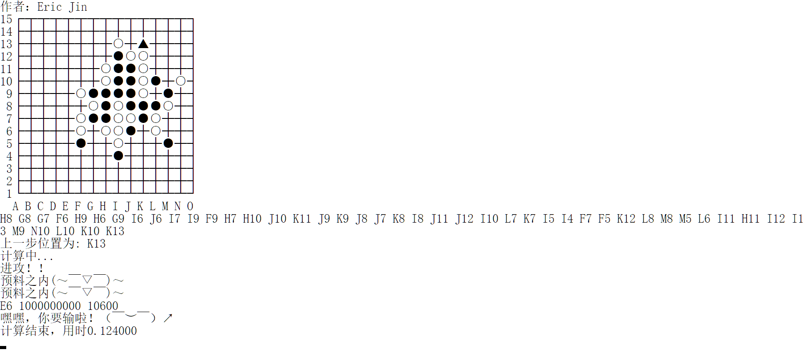

# 第二代五子棋人机对战程序

# 前言

终于把C语言课程大作业-五子棋写完了。虽然高中时曾写过一遍，本想着直接拿去用了。但一方面，学校课程要求纯C完成、不能有图形界面；另一方面，规则相比原来复杂许多，增添了禁手限制——看来还是得重新写一遍。＞﹏＜

具体代码计划于课程结束后扔到[EricJin2002/wuziqi: UCAS大二C语言课程大作业 (github.com)](https://github.com/EricJin2002/wuziqi)。

# 编译

## linux/gcc
编译参数记得加上

​		"-lm", //调用了math.h中的pow函数

​        "-finput-charset=GBK" //文件编码格式为GBK

## windows/msvc
务必确保使用x64 Release编译
（Debug版本会影响15s内的计算能力，x64是因为运行内存可能会超过5G）

默认输出新版控制台界面，可在命令提示符-属性-选项处设置

如果使用旧版控制台，请注释wuziqi.h中第3行

```c
#define NEW_CMD
```

# 界面





# 更新

**211227更新**：更改minmax底层估值逻辑

**211128更新**：优化了深搜时的禁手判断逻辑，减小了时间复杂度。程序运行速度得到极大的改善。

**211203更新**：修复了上一版本无禁手模式下禁手判断的一个bug。

**211211更新**：重构代码，头文件与源文件分离；优化估值函数。

# 思路

（好早之前写的，后来优化了挺多地方，请以实际代码为准）

## 规则

先手禁手，禁双三、双四、长连。

禁手与连五同时达成时，获胜为先。

黑方第一子必下天元。

## 基础功能

### 棋手

先手为黑，后手为白。为了方便逻辑判断，将两种颜色宏定义到1和0。

```c
#define black 1
#define white 0
```

### 棋盘

#### 棋盘的存储

棋盘通过一个全局数组（board）存储，默认设空，值为0。每下一子，在数组的对应位置记录当前落子步数（step）。并生成黑方禁手点，记录值为-2。

因此，通过判断数组值的正负性可以确定对应点是否为空，通过判断奇偶性可以确定落子方的颜色。

```c
int step;
int board[16][16];
```

#### 棋盘的打印

制表字符可以参考[方框绘制字符 - 维基百科](https://zh.wikipedia.org/wiki/%E6%96%B9%E6%A1%86%E7%BB%98%E5%88%B6%E5%AD%97%E7%AC%A6)。需要额外注意的是，不同终端下输出的字符宽度不同，需要根据特定的编译环境指定对应的字符。

```c
void print_char(int i,int j){
    if(board[i][j]==0){
        if(i==15){
            printf(j==1?"┌":j==15?"┐":"┬");
        }else if(i==1){
            printf(j==1?"└":j==15?"┘":"┴");
        }else{
            printf(j==1?"├":j==15?"┤":"┼");
        }
    }else if(board[i][j]==-2){
        printf("×");
    }else if(board[i][j]%2){//black
        printf(board[i][j]==step-1?"▲":"●");
    }else{//white
        printf(board[i][j]==step-1?"△":"○");
    }
#ifdef __linux__
    if(j!=15) printf("─");
#endif
    return;
}
```

``` c
void print_board(){
    for(int i=15;i>=1;i--){
        printf("%2d",i);
        for(int j=1;j<=15;j++){
            print_char(i,j);
        }
        printf("\n");
    }
    printf(" ");
    for(int j=1;j<=15;j++){
        printf(" %c",'A'-1+j);
    }
    printf("\n");
}
```

### 输入

使用函数（get_input）输入到全局变量（x，y），具体实现略。

``` c
int x,y;
bool get_input();
```

需要注意的是，输入有可能不合法，此时需要引入错误判断（judge_input）。如果没有错误，则存储落子时间到对应的落子点（store_input），并更新时间线（如果需要悔棋功能的话）。如果有错误，更新错误变量（err）为当前错误代码，并输出（print_err）。

```c
int err;
bool judege_input();
bool print_err(){
    switch (err){
    case 1:printf("横坐标违法输入\n");break;
    case 2:printf("纵坐标违法输入\n");break;
    case 3:printf("该位置已经有子\n");break;
    case 4:printf("第一子当落天元\n");break;
    case 10:printf("该点为黑方禁手\n");break;
    case 8:
        printf(step%2?"白方":"黑方");
        printf("获胜\n\n");
        return false;
    case 9:printf("平局\n\n");return false;
    while(true){
        case 5:printf("悔棋两步，");break;
        case 6:printf("悔棋一步，");break;
        case 7:printf("无法悔棋，");break;
    }
    default:
        if(step!=1) printf("上一步位置为: %c%d\n",'A'+last_y-1,last_x);
        else printf("第一步请落天元\n");
        break;
    }
    err=0;
    return true;
}
```

### 胜负判断

每次落点，遍历该点的四个方向。对每个方向，从落子点向两端延伸，直至遇到非同色点或成五。需要额外注意的是，延伸范围不能超过棋盘边缘。

```c
bool win_or_not(int x0,int y0,bool whom){
    int i=1,j=1;
    while(i+j!=6&&(x0+i<=15&&board[x0+i][y0]>0&&board[x0+i][y0]%2==whom&&++i||x0-j>=1&&board[x0-j][y0]>0&&board[x0-j][y0]%2==whom&&++j));
    if(i+j==6) return true;
    i=1;j=1;
    while(i+j!=6&&(y0+i<=15&&board[x0][y0+i]>0&&board[x0][y0+i]%2==whom&&++i||y0-j>=1&&board[x0][y0-j]>0&&board[x0][y0-j]%2==whom&&++j));
    if(i+j==6) return true;
    i=1;j=1;
    while(i+j!=6&&(x0+i<=15&&y0+i<=15&&board[x0+i][y0+i]>0&&board[x0+i][y0+i]%2==whom&&++i||x0-j>=1&&y0-j>=1&&board[x0-j][y0-j]>0&&board[x0-j][y0-j]%2==whom&&++j));
    if(i+j==6) return true;
    i=1;j=1;
    while(i+j!=6&&(x0+i<=15&&y0-i>=1&&board[x0+i][y0-i]>0&&board[x0+i][y0-i]%2==whom&&++i||x0-j>=1&&y0+j<=15&&board[x0-j][y0+j]>0&&board[x0-j][y0+j]%2==whom&&++j));
    if(i+j==6) return true;
    return false;
}
```

### 初始化

在游戏开始前，调用函数（choose_player）来选定双方玩家是否为机器（is_robot），以及选择是否开启禁手功能（ban_black）。然后，调用函数（initialize）对数组等变量初始化。

```c
bool is_robot[2];
bool ban_black;
void choose_player();
void initialize();
```

### 流程

一个完整的实现可以表示如下：

```c
int main(){
#ifndef __linux__
    system("color F0");
#endif
    //暂时忽略这一段
    black_robot.fg=fg5;
    black_robot.re=re5;
    black_robot.nt=nt5;
    white_robot.fg=fg5;
    white_robot.re=re5;
    white_robot.nt=nt5;
    
    choose_player();
    initialize();
    while(++step){
        if(ban_black) lianzhu_refresh_ban();
        clear();
        print_board();
        if(!print_err()) break;
        if(!(get_input()&&judge_input())) continue;
        store_input();
        //getchar();
        sleep(1);
    }
    getchar();
}
```

为了兼容不同平台，宏定义了sleep()与clear()函数。

```c
#if defined(WIN32) || defined(_WIN32) || defined(__WIN32__) || defined(__NT__)
#include <conio.h>
#include <windows.h>
#define sleep(a) Sleep(1000*(a))
#define clear() system("cls")
#elif __linux__
#include <unistd.h>
#define clear() system("clear")
#endif
```

## 悔棋

### 触发

在玩家输入函数（get_input）处完成判断。当输入"re","rE","Re","RE"之一时触发悔棋。

```c
bool get_input(){
    ...
        if(!(strcmp(input,"re")&&strcmp(input,"Re")&&strcmp(input,"RE")&&strcmp(input,"rE"))){
			...
            return false;
        }
    ...
}
```

### 实现

悔棋主要通过维护一个落子的时间线数组（timeline）实现。

``` c
typedef struct point{
    int x,y;
}point;
point timeline[15*15+2];
```

每次悔棋（retract）时，从时间线中读取之前一到两个值，并悔棋一到两步（两步是因为人机对战时，单悔棋一步会立刻被机器落子覆盖，导致无法成功悔棋）。

```c
void retract(){
    if(--step){
        int prev_x=timeline[step].x;
        int prev_y=timeline[step].y;
        board[prev_x][prev_y]=0;
        if(--step){
            prev_x=timeline[step].x;
            prev_y=timeline[step].y;
            board[prev_x][prev_y]=0;
            err=5;
        }else{
            err=6;
            step++;
        }
    }else{
            err=7;
            step++;
    }
    if(--step){
        last_x=timeline[step].x;
        last_y=timeline[step].y;
    }
}
```

为便利后续落子机器悔棋，引入函数（announce_retract）通知机器玩家触发了悔棋。

```c
void announce_retract(){
    if(is_robot[black]) black_robot.re(black);
    if(is_robot[white]) white_robot.re(white);
}
```

## 连珠

### 定义

使用lianzhu.h来实现对棋盘上特定位置特定方向上同色子列的判断。

包括长连、成五、活四、冲四、死四、双四、活三、跳活三、眠三、活二、眠二等，利用宏定义。

```c
#define CHANG_LIAN 6
#define CHENG_5 5
#define HUO_4 4
#define CHONG_4 104
#define SI_4 40
//#define _3_4 34
#define _4_4 44
#define HUO_3 3
#define TIAO_HUO_3 103
#define MIAN_3 30
#define HUO_2 2
#define MIAN_2 20
```

### 寻找特定方向上的连续同色子列

通过函数（lianzhu_find）实现。从点（x0，y0）开始，逐次偏移（dx，dy），直至遇到非同色的点，记录该点是否为空（blank）并返回。

### 判断特定方向上的同色子列

通过函数（lianzhu_calc）实现。重复调用（lianzhu_find），完成对两个对立方向的查找。当遇到空点时，会继续调用依次查找函数。返回对该方向上长连、成五、活四、冲四、死四、双四、活三、跳活三、眠三、活二、眠二等状态的判断。

## 禁手

### 禁手判断

对于给定的点，遍历四个方向调用函数（lianzhu_calc），统计所有方向上连三、连四、连五的数目，返回该点是否为禁手点。

```c
bool lianzhu_judge_ban(int x0,int y0){
    int _3=0;
    int _4=0;
    bool ban=false;
    bool win=false;
    int ans[5];
    for(int dir_4=1;dir_4<=4;dir_4++){
        ans[dir_4]=lianzhu_calc(x0,y0,black,dir_4,false);
    }
    for(int dir_4=1;dir_4<=4;dir_4++){
        switch (ans[dir_4]){
        case CHANG_LIAN: ban=true;break;
        case CHENG_5: win=true;break;
        case HUO_4: _4++;break;
        case CHONG_4: _4++;break;
        //case SI_4: break;//really?
        case _4_4: ban=true;break;
        case HUO_3: _3++;break;
        case TIAO_HUO_3: _3++;break;
        //case MIAN_3: break;
        default: break;
        }
    }
    if(win) return false;
    if(ban) return true;
    if(_3>=2||_4>=2) return true;
    return false;
}
```

### 刷新

遍历棋盘上的所有点，向棋盘数组（board）标记禁手信息。

```c
void lianzhu_refresh_ban(){
    for(int i=1;i<=15;i++){
        for(int j=1;j<=15;j++){
            if(board[i][j]<=0){
                board[i][j]=lianzhu_judge_ban(i,j)?-2:0;
            }
        }
    }
}
```

棋盘全刷（lianzhu_refresh_ban）比较耗时，为了提升效率，可以刷新当前落子点四个方向上周围的点（lianzhu_refresh_ban_near）。

```c
void lianzhu_refresh_ban_near(int x0,int y0){
    for(int dir_8=1;dir_8<=8;dir_8++){
        int dx=0,dy=0,score=0;
        switch (dir_8){
        case 1:dx=dy=1;break;
        case 2:dx=1;break;
        case 3:dx=1;dy=-1;break;
        case 4:dy=-1;break;
        case 5:dx=dy=-1;break;
        case 6:dx=-1;break;
        case 7:dx=-1;dy=1;break;
        case 8:dy=1;break;
        default:break;
        }
        int x1,y1,dir_4;
        for(int k=1;k<=5;k++){
            x1=x0+k*dx;
            y1=y0+k*dy;
            if(x1>=1&&x1<=15&&y1>=1&&y1<=15){
                if(board[x1][y1]<=0) board[x1][y1]=lianzhu_judge_ban(x1,y1)?-2:0;
            }else{
                break;
            }
        }
    }
}
```

## 落子机器

### 第一代

高中时完成了第一代五子棋，能正常防御双三、三四、双四等进攻。

#### 思路及其实现

参见[五子棋 - 人机对战](https://www.lazybirds.xyz/?p=93)

#### 改进

主要改进点在于综合不同方向权值所采用的方法。

原文思路是计算特定方向上白子与黑子赋值的差值，并依据其大小预处理原始数据，再将四个方向的权值相加。

其中的预处理过程是为了凸显特定方向的权值、避免重要信息在多方向权值综合时被其他方向掩盖。

原文使用了分段线性处理原始权值，来放大连三、连四、连五的权值。现改进为幂次运算，通过机器自我博弈得出理想幂次在2-3之间，采用平方运算代替原始分段线性运算，实测更优。

#### 一些继续改进的思路

可以引入搜索算法，向后搜索几层，寻找是否存在活三、活四等必胜点。

### 第一点五代

#### 起因

单纯的深度搜索难以比较不同局面的优劣，这限制了搜索的效用。一种改进方法是构造一个全局局势估值算法，使用min-max搜索来代替朴素的深搜（from lzy）。

#### 思路

一种基于五元组的实现方法（from xzh）给我带来了巨大启发。可以从头到尾沿各方向扫描棋盘，统计其中连三、连四、连五的数目，来为局势估值。总局势值为己方估值减去敌方估值，并对各方向求和。

统计函数可以使用字符串匹配算法（KMP）（from lzy）。

#### 实现

没有实现（至今没找到bugつ﹏⊂）

### 第二代

#### 起因

一方面，如果要使用min-max算法，考虑到同时维护逐点估值逻辑和全局局势逻辑，会造成算法冗长、性能低下。要想进一步改进程序，需要对原始逐点估值逻辑下手。

另一方面，课程规则要求有禁手功能。第一代程序无法较好地应对禁手。

#### 思路

针对逐点估值逻辑的改进，可以通过判断落子点与周围各方向上五个点是否构成三、四等结构（即前文lianzhu.h囊括的内容），来进行逐点赋值。同样地，需要维护各个方向上的估值。不同的是，还需要维护黑白双方各自的估值。

最终的**各点价值来源于各方向黑白估值之和。全局局势价值来源于，各点中己方权值的极大值减去敌方权值的极大值。**（再最新版中已弃用）

#### 引入min-max搜索

具体原理详见[极小化极大算法 - 维基百科](https://zh.wikipedia.org/wiki/极小化极大算法)

这里，为了提高搜索层数，每层递归被设计成只搜索若干个价值较高的点。通过向后搜索、得出在程序可预知的范围内点对应的估值，来从这些个点中搜索出最优点。

采用这种设计主要是为了减少无用的搜索，让机器具有更长远的目光，而非沉迷眼前细节。

#### 引入alpha-beta剪枝

直接用alpha-beta算法替换min-max算法即可，详见[Alpha-beta剪枝 - 维基百科](https://zh.wikipedia.org/wiki/Alpha-beta剪枝)

剪枝算法能大大优化性能，从而在有限的时间内实现更多层数的搜索。
